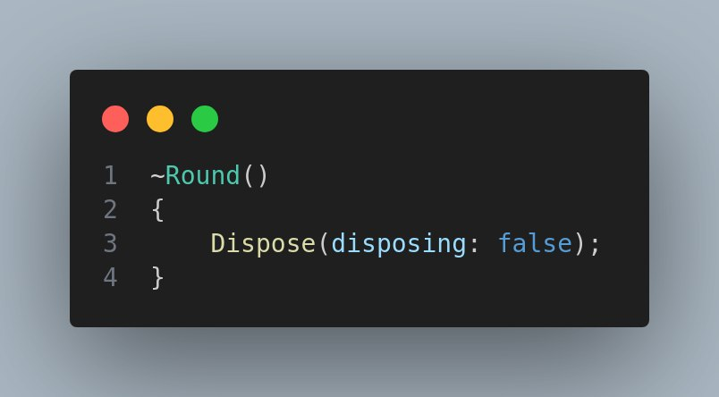
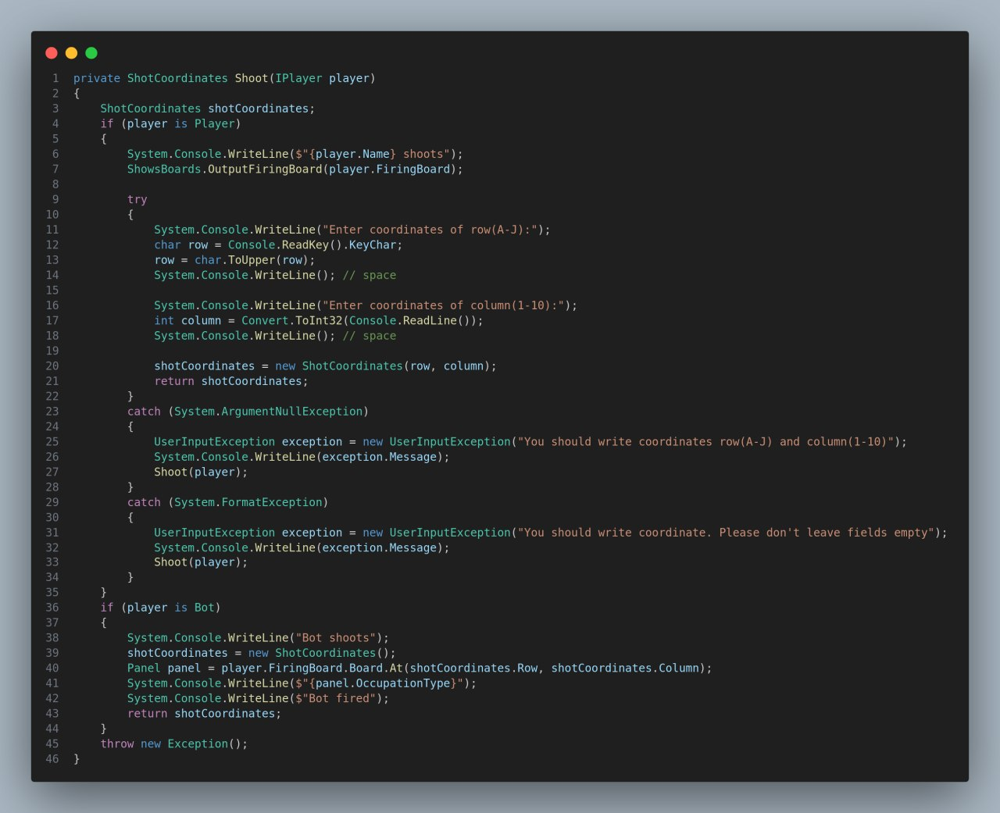

# Labaratory work 1

## C# .Net. Implementation of the basic principles of OOP in C#

Battleship
Each player gets a 10-by-10 grid on which to place five ships: the eponymous Battleship, as well as an Aircraft Carrier, a Cruiser, a Submarine, and a Destroyer. The ships have differing lengths, and larger ships can take more hits. Players cannot see the opposing player's game board.

Players also have a blank firing board from which they can call out shots. On each player's turn, they call out a panel (by using the panel coordinates, e.g. "A5" which means row A, column 5) on their opponent's board. The opponent will then tell them if that shot is a hit or a miss. If it's a hit, the player marks that panel with a red peg; if it is a miss, the player marks that panel with a white peg. It then becomes the other player's turn to call a shot.

When a ship is sunk, the player who owned that ship should call out what ship it was, so the other player can take note. Finally, when one player loses all five of his/her ships, that player loses.

## Objective:

To get acquainted with the basics of the object-oriented approach to software development in C#, the creation of classes, objects, encapsulation, inheritance and polymorphism mechanisms. Learn the resource management mechanism implemented in .Net.

## Main Classes

* Game 

The Game class encapsulates the core logic and flow of a Battleship game, ensuring that only one game instance can exist at a time, and it handles player setup, ship placement, game progression, and winner declaration.

* Round 

The Round class encapsulates the logic for a single round of the Battleship game. It manages player turns, coordinates shot selection, and updates the game state based on the outcome of the shots, including handling hits, misses, and sinking ships.

* Panel

The Panel class represents a single cell or panel on the game board and provides properties and methods to manage its state, including its occupation type and user-friendly status description. It is an essential component for tracking and displaying the game board's status during gameplay.

* Player

The Player class encapsulates the state and behavior of a player in the Battleship game, including ship placement, tracking the state of the player's ships, and managing game boards. It also provides methods to check if the player has lost and to initialize the firing board based on the opponent's game board.

## Task 

1. Ensure that classes have fields and methods with different access modifiers, and explain your choice.

Here I have used private modifier for better encapsulation of my code.

Field:

Method:

Here I have used public modifier because I need access to a variable outside the class in C#

Field:

Method:

Here I have used protected modifier because I need that this method was accessed only in this class or inhereted classes

2. Ensure the presence of properties in classes: it is more difficult than just get;set; to justify the feasibility of creating a property.

Here I have accessor which gets char and convert it to num, It's necessary for correct shooting

3. Create the following constructors for the classes being developed: default constructor, constructor with parameters, private constructor, static constructor

Default constructor:

Constructor with parameters:

Private constructor:

Static constructor:

4. Use virtual and overridden methods

5. Add methods to classes that will allow you to control the destruction of instances of these classes: implement the IDisposable interface, create destructors, ensure that conflicts between Dispose and the destructor are avoided.

## UML class diagram

[UML-Diagram](UML-class-diagram.vpp)

# Labaratory work 2

## Task 

1. A set of interfaces. And one of the classes must implement at least 2 interfaces. Also demonstrate the implementation of the explicit implementation of the interface, justify its use.

2. Abstract class. Ensure its inheritance. The presence of abstract methods in this class is mandatory.

3. The mechanism "delegate - event - event handler".

4. Convert code that works with events and event handlers to code that uses: anonymous methods; lambda expressions; Action and Func types (each of them). It is allowed to implement the code of one event in different ways, not necessarily different events.

5. Mechanism for creating and handling your own errors: create a new exception class; create a new class of arguments to pass to the exception handler;
ensure the initiation of the created exception and demonstrate how the error handler works;
implement various error handling scenarios.

6. Method-extension of any class.

